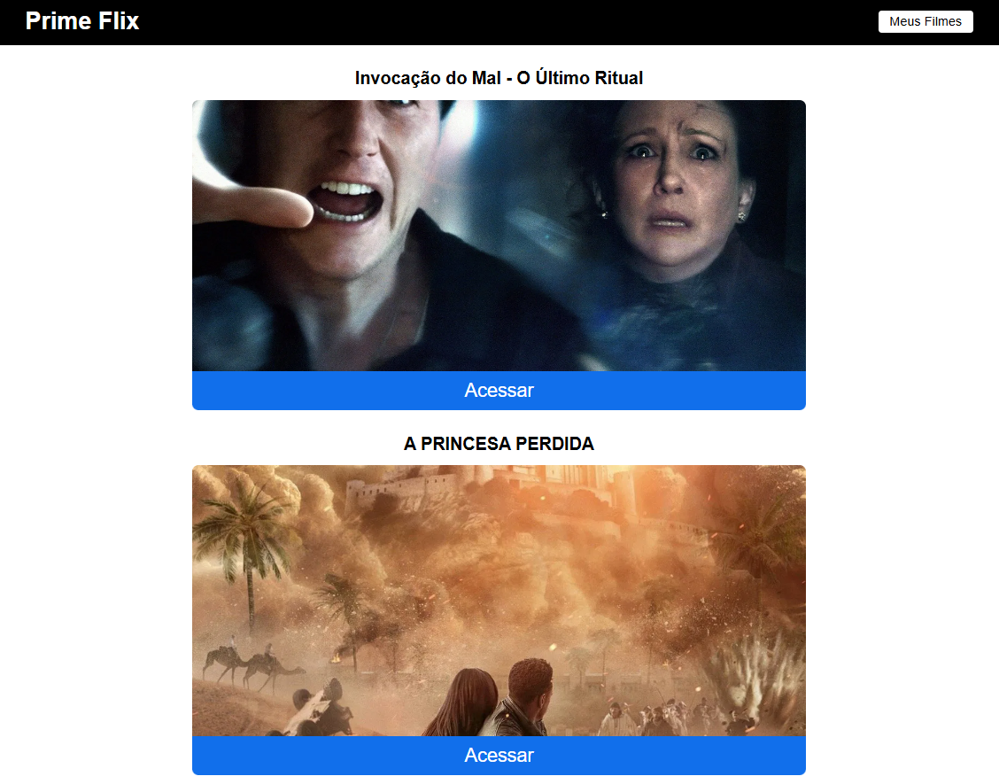
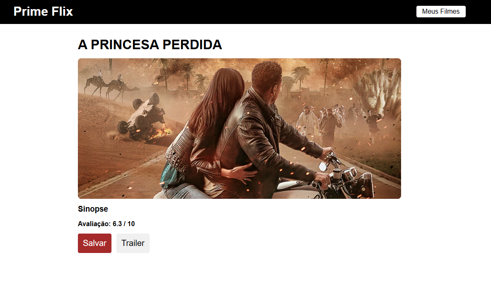
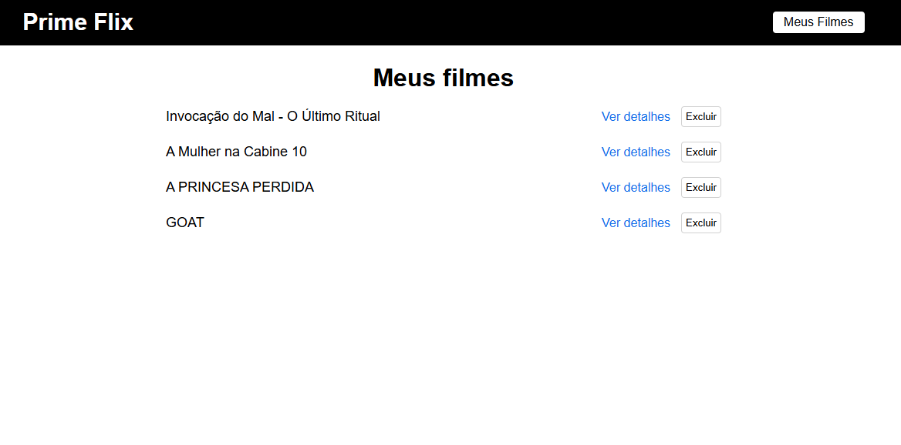

# Prime Flix 🎬

> A movie catalog developed as a ReactJS study project. This application consumes [The Movie Database (TMDB)](https://www.themoviedb.org/) API to list current movies, display details, and allow users to manage their own list of favorites.

**[🚀 Live Demo Here!](https://prime-flix-git-main-simeis-projects-c8ff22e1.vercel.app)**
---

<table>
  <tr>
    <td></td>
    <td></td>
    <td></td>
  </tr>
</table>

---

## ✨ Features

* **Movie Listing:** Displays a list of movies currently in theaters, consuming data directly from the TMDB API.
* **Movie Details:** By clicking on a movie, the user is redirected to a details page with a synopsis, cover image, and rating.
* **Favorites System:** Users can save movies to a "My Movies" list.
* **Data Persistence:** The favorites list is saved in the browser's `localStorage`, ensuring that saved movies are not lost when the page is closed.
* **Remove from Favorites:** Users can remove a movie from their list at any time.
* **User Feedback:** The system uses toast notifications to inform the user when a movie is saved, removed, or if it's already on the list.
* **Routing:** Smooth navigation between pages using `react-router-dom`.

---

## 🚀 Technologies Used

This project was built using the following technologies:

* **[ReactJS](https://reactjs.org/)**
* **[React Router DOM](https://reactrouter.com/web/guides/quick-start)**
* **[Axios](https://axios-http.com/)** for API requests.
* **[React Toastify](https://fkhadra.github.io/react-toastify/introduction)** for notifications.
* **CSS3** for styling and responsiveness.

---

## 🧠 What I Learned

This project was crucial for solidifying my knowledge of the React ecosystem. The main learning outcomes were:

* **Consuming External APIs:** Making `GET` requests with Axios, handling the response, and displaying the data in the user interface.
* **Essential React Hooks:**
    * `useState`: To manage component state (movie lists, loading states, etc.).
    * `useEffect`: To control the component lifecycle and fetch API data as soon as the component mounts.
    * `useParams`: To capture URL parameters (like the movie ID).
    * `useNavigate`: To perform page redirects.
* **Routing with React Router DOM:** Creating routes for different application pages (`Home`, `Movie`, `Favorites`) and setting up a 404 error route.
* **Manipulating Local Storage:** Learning to save and read data in the browser to implement the persistence feature for the favorites list.
* **Componentization:** Structuring the application into reusable components, such as the `Header`.

---

## ⚙️ How to Clone and Run the Project

Follow the steps below to run the project on your local machine.

1.  **Clone the repository:**
    ```bash
    git clone [https://github.com/simeimoda/Prime-Flix.git]
    ```

2.  **Navigate to the project directory:**
    ```bash
    cd prime-flix
    ```

3.  **Install the dependencies:**
    ```bash
    yarn install
    ```

4.  **Set up the environment variables:**
    * Create a file named `.env` in the root of the project.
    * You will need an API key from TMDB. You can get one for free by signing up on [The Movie Database](https://www.themoviedb.org/documentation/api) website.
    * Add the following line to your `.env` file:
        ```
        REACT_APP_API_KEY="YOUR_API_KEY_HERE"
        ```

5.  **Start the development server:**
    ```bash
    yarn start
    ```

The application will be available at `http://localhost:3000`.
